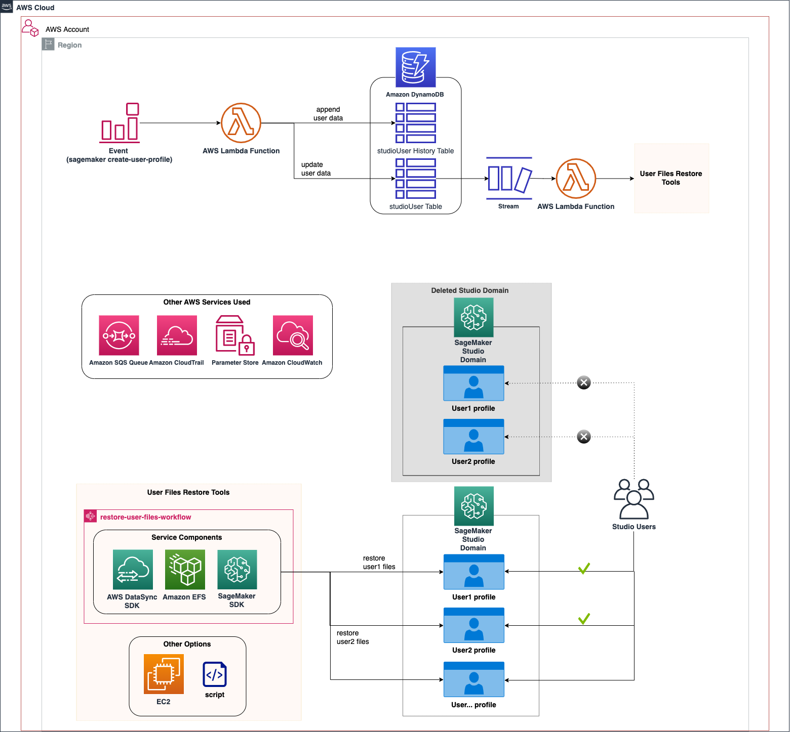
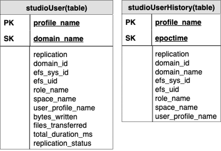
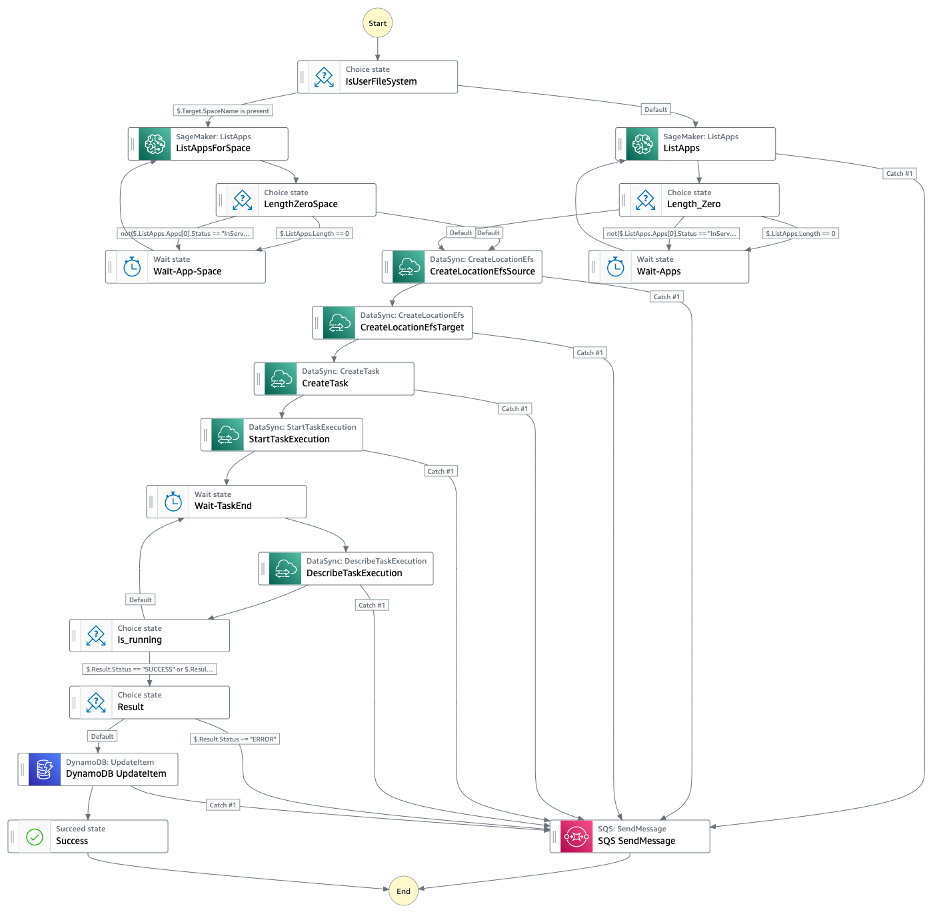
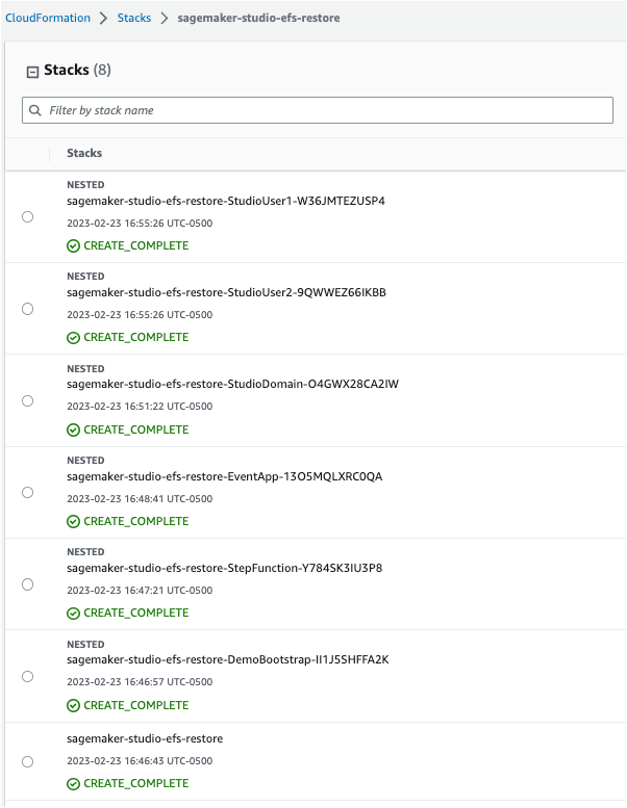
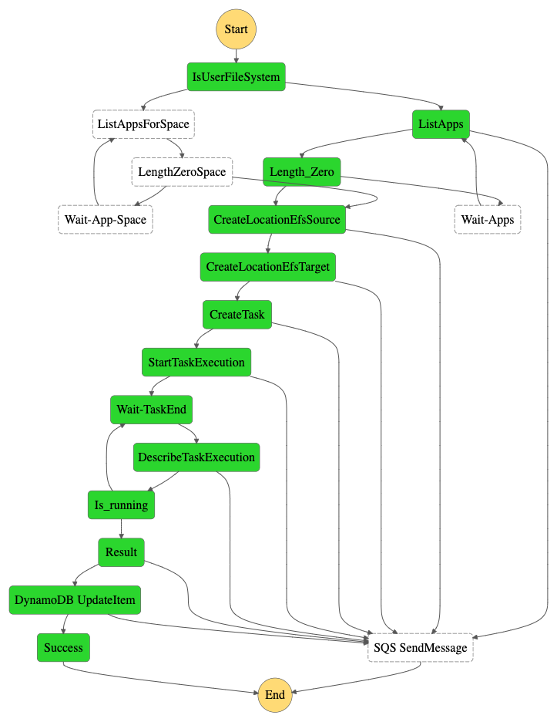
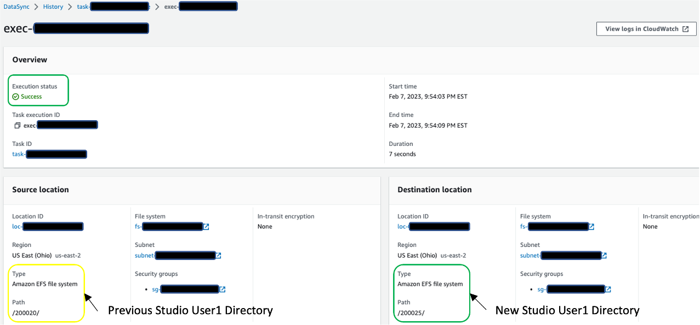

# Amazon SageMaker Studio Domain Backup and Recovery Using Event-Driven Serverless Architecture
***
This pattern shows how to back up and recover users' work in Amazon SageMaker Studio Domain when user profiles are deleted and recreated. Currently, SageMaker Domain does not support mounting custom or additional Amazon EFS volumes based on the [Developer Guide](https://docs.aws.amazon.com/sagemaker/latest/dg/studio-tasks-manage-storage.html), which means that studio users will lose access to the data stored in their profile directory if the Studio Domain and Studio UserProfile are deleted. Losing access to removed user directories may decrease productivity of Data Scientists if backup and recovery solutions are unavailable. To solve this problem, we provide a solution to supplement [the SageMaker Studio Admin Best Practices Whitepaper](https://docs.aws.amazon.com/whitepapers/latest/sagemaker-studio-admin-best-practices/appendix.html#studio-domain-backup-and-recovery). In addition, we demonstrate an event-driven application as one approach to automate the backup and recovery process.

**Important**: this application uses various AWS services and there are costs associated with these services after the Free Tier usage - please see the [AWS Pricing page](https://aws.amazon.com/pricing/?aws-products-pricing.sort-by=item.additionalFields.productNameLowercase&aws-products-pricing.sort-order=asc&awsf.Free%20Tier%20Type=*all&awsf.tech-category=*all) for details. You are responsible for any AWS costs incurred. No warranty is implied in this example.

## Use Case Overview
***
We describe some of the prevailing use cases that may require Studio Domain backup and recovery solution.  
- the KMS key change
  - ex. customer-managed CMK to AWS-managed key requires recreation of the SageMaker Domain. 
- change of onboarding
  - ex. from IAM authentication to Single Sign-On (SSO) requires recreation of the SageMaker Domain
- migrating from a single Studio Domain to multiple Studio Domains. 
  - For instance, customer might want to distribute and reassign Data Scientists within a single Domain to multi-Domain based on respective Business Unit or Projects.
- replication of Studio Domain and Profile
  - For instance, create a new Domain by copying files from the source directory to the new directory, and delete the original Studio Domain after X months.
- accidental deletion of Domain and Profile

## Architecture
***

The event-driven app includes the following steps:
1.	Amazon CloudWatch Events Rule uses AWS CloudTrail to track CreateUserProfile and CreateSpace API calls, trigger the rule and invoke the AWS Lambda Function.
2.	The Lambda Function update the user table and append item in the history table in Amazon DynamoDB. In addition, the database layer keeps track of the domain and profile name and filesystem mapping. The below image shows the DynamoDB tables structure. The partition key and sort key in the studioUser table consist of the profile and domain name. The replication column holds the replication flag with true as the default value. In addition, bytes_written, bytes_file_transferred, total_duration_ms, and replication_status fields are populated when the replication completes. 
3.	DynamoDB Streams is enabled on the user table, and the Lambda Function is set as a trigger and synchronously invoked when new stream records are available.
4.	Another Lambda Function trigger the process to restore the user files using the User Files Restore Tools in the diagram, which is described below. 

The backup and recovery workflow includes the following steps:
5. The backup and recovery workflow consists of the AWS Step Functions, which is integrated with other AWS services including AWS DataSync, to orchestrate the recovery of the user files from the detached private home directory to a new directory in Studio Domain EFS. With The Step Functions Workflow Studio, the workflow can be implemented with a no-code, such as in this case, or a low-code for a more customized solution. The Step Function is invoked when the user profile creation event is detected by the event-driven app.
6. For each profile, the Step Functions execute the DataSync task to copy all files from their previous directories to the new directory. The image below is the actual graph of the Step Functions. Note ListApp* step in the Step Functions ensure the profile directories are populated in the Studio EFS before proceeding. Also, we implemented retry with exponential backoff to handle API throttle for DataSync CreateLocationEfs and CreateTask API calls.
 
7. When the users open their Studio, all the files from respective directories from the previous directory will be available to continue their work. The DataSync job replicating one gigabyte of data from our experiment took approximately one minute.

## Tools and Services
***
- [Amazon SageMaker Studio](https://aws.amazon.com/sagemaker/studio/) - Amazon SageMaker Studio is an integrated development environment (IDE) that provides a single web-based visual interface that supports end-to-end model development and deployment.
- [AWS Step Functions](https://aws.amazon.com/step-functions/) - AWS Step Functions is a visual workflow service that helps developers use AWS services to build distributed applications, automate processes, orchestrate microservices, and create data and machine learning (ML) pipelines.
- [AWS DataSync](https://aws.amazon.com/datasync/) - AWS DataSync is a secure, online service that automates and accelerates moving data between on premises and AWS Storage services. DataSync can copy data between Amazon EFS file systems, NFS shares, SMB shares, HDFS, Amazon S3 buckets, and more.
- [AWS Lambda](https://aws.amazon.com/lambda/) - AWS Lambda is a serverless compute service that lets you run code without provisioning or managing servers, creating workload-aware cluster scaling logic, maintaining event integrations, or managing runtimes.
- [Amazon Simple Queue Service](https://aws.amazon.com/sqs/) - Amazon Simple Queue Service (SQS) is a fully managed message queuing service that enables you to decouple and scale microservices, distributed systems, and serverless applications.
- [Amazon DynamoDB](https://aws.amazon.com/dynamodb/) - Amazon DynamoDB is a fully managed, serverless, key-value NoSQL database designed to run high-performance applications at any scale.
- [AWS CloudFormation](https://aws.amazon.com/cloudformation/) - AWS CloudFormation lets you model, provision, and manage AWS and third-party resources by treating infrastructure as code.
- [Amazon CloudWatch](https://aws.amazon.com/cloudwatch/) - Amazon CloudWatch collects and visualizes real-time logs, metrics, and event data in automated dashboards to streamline your infrastructure and application maintenance.
- [AWS Systems Manager](https://aws.amazon.com/systems-manager/) - Parameter Store, a capability of AWS Systems Manager, provides secure, hierarchical storage for configuration data management and secrets management.
- [AWS CloudTrail](https://aws.amazon.com/cloudtrail/) - AWS CloudTrail monitors and records account activity across your AWS infrastructure, giving you control over storage, analysis, and remediation actions.
- [AWS IAM](https://aws.amazon.com/iam/) - With IAM, you can specify who or what can access services and resources in AWS, centrally manage fine-grained permissions, and analyze access to refine permissions across AWS.
## Requirements
***
- [Create an AWS account](https://portal.aws.amazon.com/billing/signup?redirect_url=https%3A%2F%2Faws.amazon.com%2Fregistration-confirmation#/start/email) if you do not already have one and log in. The IAM user that you use must have sufficient permissions to make necessary AWS service calls and manage AWS resources.
- [AWS SAM CLI](https://docs.aws.amazon.com/serverless-application-model/latest/developerguide/install-sam-cli.html) installed and configured
- [Setup AWS Credentials](https://docs.aws.amazon.com/cli/latest/userguide/cli-chap-configure.html)
- [Git Installed](https://git-scm.com/book/en/v2/Getting-Started-Installing-Git)
- Python 3.9
- You need to use the existing [Amazon Virtual Private Cloud (VPC)](https://aws.amazon.com/vpc/) and [Amazon Simple Storage Service (S3)](https://aws.amazon.com/s3/) Bucket to follow the deployment step.
- Also, please be aware of the Service Quota for the maximum number of DataSync tasks per account per Region (default is 100). You can request a quota increase to meet the number of replication tasks for your use case.
## Limitations
***
- The solution currently does not support cross-account backup and recovery.
- For services availability based on region, please refer to [AWS Regional Services List](https://aws.amazon.com/about-aws/global-infrastructure/regional-product-services/).
## Deployment Instructions
***
### Setup Studio profile recovery infrastructure:
1. Clone the GitHub repo in the Terminal: 
   ```bash
   git clone https://github.com/aws-samples/sagemaker-studio-efs-recovery-serverless.git && cd sagemaker-studio-efs-recovery-serverless
   ```
   Display deployment script usage
   ```bash
   bash deploy.sh -h
   Usage: deploy.sh [-n <stack_name>] [-v <vpc_id>] [-s <subnet_id>] [-b <s3_buket>] [-r <aws_region>] [-d]
   Options:
   -n: specify stack name
   -v: specify your vpc id
   -s: specify subnet
   -b: specify s3 bucket name to store artifacts
   -r: specify aws region
   -d: whether to skip a creation of a new SageMaker Studio Domain (default: no)
   ```
2. If you want to create a new SageMaker domain, go to steps 3. To use an existing domain, skip to step 4 otherwise.
3. Run the following command. You need to specify which Amazon Virtual Private Cloud (VPC) and subnet you want to use. We will use VPC only mode for the Studio deployment. If you don't have any preference, you can use the default vpc and subnet. Also, specify any stack name, AWS Region, and Amazon Simple Storage Service (Amazon S3) name for the SAM to deploy the AWS Lambda Function.
   ```bash
   bash deploy.sh -v <vpc_id> -s <subnet_id> -b <s3_bucket_name> -n <stack_name> -r <aws_region>
   ```
4. If you want to use the existing Studio domain, run the following command. Option -d yes, will skip creating a new Studio domain.
   ```bash
   bash deploy.sh -v <vpc_id> -s <subnet_id> -b <s3_bucket_name> -n <stack_name> -r <aws_region> -d yes
   ```
   For the existing domains, the SageMaker Administrator must also update the source and target Studio EFS Security Group(s) to allow connection to the user and space file restore tool. For example, to run the following command, you need to specify HomeEfsFileSystemId, the Amazon EFS file system ID, and SecurityGroupId used by the user and space file restore tool (Refer to step 5 of the second test scenario for more details).
   ```bash
   python3 src/add-security-group.py --efs-id <HomeEfsFileSystemId> --security-groups <SecurityGroupId> --region <aws_region>
   ```   
### User and space recovery flow:
If the profile (user or space) and Domain are accidentally deleted, the Amazon EFS volume is detached but not deleted. A possible scenario is that we may want to revert the deletion by recreating a new domain and profiles. If the same profiles are being onboarded again, they may wish to access the files from their respective workspace in the detached volume. The recovery process is almost entirely automated; the only action required by the SageMaker Administrator is to recreate the Studio and profiles using the same CloudFormation template. The rest of the steps are automated.
5. (Optional) if SageMaker Admin wants control over replication, run the following command to turn off replication for specific Domains and profiles. This script will update the replication field given the Domain and profile name in the table. Note: you need to run the script for the same user each time they get recreated.
   ```bash
   python3 src/update-replication-flag.py --profile-name <profile_name> --domain-name <domain_name> --region <aws_region> --no-replication
   ```
6. (Optional) This step provides the solution to allow replication to take place between the specified source file system to any new target Domain and profile name. If the SageMaker Admin wants to replicate particular profile data to different Domain and profile that doesn’t exist yet, run the following command.  The script will insert the new Domain and profile name with the specified source file system information. When the profile is actually created, it will trigger the replication task. Note: you need to run the add-security-group.py from the previous step to allow connection to the file restore tool. 
   ```bash
   python3 src/add-replication-target.py --src-profile-name <profile_name> --src-domain-name <domain_name> --target-profile-name <profile_name> --target-domain-name <domain_name> --region <aws_region>
   ```
## How It Works
***
| Templates | Description |
| --- | --- |
| `ssm.yaml` | Bootstraps deployment configs in Parameter Store |
| `stepfunction.yaml` | Create a Step Functions to copy files between SageMaker Domain EFS |
| `event-app.yaml` | Create an event-driven app consisting of CloudWatch Event Rule, DynamoDB Streams, and Lambda  |
| `sagemaker-studio-domain.yaml` | Create a SageMaker Studio Domain |
| `sagemaker-studio-user.yaml` | Create a SageMaker Studio UserProfile |
| `sagemaker-studio-space.yaml` | Create a SageMaker Studio Space |

| Scripts | Description |
| --- | --- |
| `seed-table.py` | This script is only used if DDBInitialSeed is set to [ENABLE](template.yaml). It lists the current Studio UserProfiles and seeds the DynamoDB tables with the user metadata |
| `event-processor.py` | Process the `CreateUserProfile Event` from CloudWatch Event Rule, update the user table, and put an item in the history table |
| `ddb-stream-processor.py` | Process the `Update Event` from the DynamoDB stream and invokes the Step Functions with the Studio EFS recovery input  |
| `add-security-group.py` | This script is invoked when [SageMaker Domain CloudFormation](Infrastructure/Templates/sagemaker-studio-domain.yaml) is deployed. The script updates the Security Groups for Home EFS. For DataSync Task to copy files between EFS, we need to update the Security Groups according to [the Documentation](https://docs.aws.amazon.com/datasync/latest/userguide/create-efs-location.html). Therefore, the script will update the Security Group of the specified EFS by allowing inbounds from the DataSync Security Group as a source using Port 2049.
| `add-replication-flag.py` | This script is used to toggle the replication flag for specified domain/profile names.
| `update-replication-target.py` | This script is used to adjust the user-filesystem mapping table to allow replication to specified new target domain/profile from the source.

## Testing - Scenario I (create a new Studio Domain)
***
Our first test scenario assumes you are starting from scratch and want to create a new Studio Domain and profiles in your environment using our templates. Then, we will deploy the Studio Domain, user and space, backup and recovery workflow, and the event app. The purpose of the first scenario is to confirm profile file is recovered in the new home directory automatically when the profile is deleted and recreated within the same Studio Domain.
1. To deploy the application, run the following command:
   ```bash
   bash deploy.sh -v <vpc_id> -s <subnet_id> -b <s3_bucket_name> -n <stack_name> -r <aws_region>
   ```
2. In [AWS CloudFormation Console](https://console.aws.amazon.com/cloudformation/home), ensure the following stacks are in **CREATE_COMPLETE** status:
      1. `<stack_name>-DemoBootstrap-*`
      2. `<stack_name>-StepFunction-*`
      3. `<stack_name>-EventApp-*`
      4. `<stack_name>-StudioDomain-*`
      5. `<stack_name>-StudioUser1-*`
      6. `<stack_name>-StudioUser2-*`
      
3. If the deployment failed in any of the stacks, check the error and resolve the issues. Then, proceed to the next step only if the problems are resolved.
4. In [Amazon DynamoDB Console](https://console.aws.amazon.com/dynamodbv2/home), select **Tables** and confirm that `studioUser` and `studioUserHistory` tables are created.
5. From **Table**, select `studioUser` and select **Explore table items** to confirm that items for `user1` and `user2` are populated in the table.
6. Open Studio
   1. Open [the Amazon SageMaker console](https://console.aws.amazon.com/sagemaker/)
   2. On the left navigation pane, choose **Domains**
   3. On the right side, in the **Domains** tab, select `demo-myapp-dev-studio-domain`. Then, on the **User profiles** tab, select `user1` and click **Launch** and select **Studio** to open the Studio for the user. **Note**: The Studio may take 10-15 minutes to load for the first time.
   4. On the **File** menu, choose **Terminal** to launch a new terminal within Studio.
   5. Run the following command in the terminal to create a file for testing.
        ```bash
        echo "i don't want to lose access to this file" > user1.txt
        ```
7. Delete Studio User `user1` and `space1` by removing the nested stacks, `<stack_name>-StudioUser1-*` and `<stack_name>-StudioSpace-*` from the parent. Delete the stacks by commenting out the below code blocks from the SAM template file, template.yaml. Make sure to save the file after the edit:
    ```bash
   StudioUser1:
     Type: AWS::Serverless::Application
     Condition: CreateDomainCond
     DependsOn: StudioDomain
     Properties:
       Location: Infrastructure/Templates/sagemaker-studio-user.yaml
       Parameters:
         LambdaLayerArn: !GetAtt DemoBootstrap.Outputs.LambdaLayerArn
         StudioUserProfileName: !Ref StudioUserProfileName1
         UID: !Ref UID
         Env: !Ref Env
         AppName: !Ref AppName
   StudioSpace:
     Type: AWS::Serverless::Application
     Condition: CreateDomainCond
     DependsOn: StudioDomain
     Properties:
       Location: Infrastructure/Templates/sagemaker-studio-space.yaml
       Parameters:
         LambdaLayerArn: !GetAtt DemoBootstrap.Outputs.LambdaLayerArn
         StudioSpaceName: !Ref StudioSpaceName
         UID: !Ref UID
         Env: !Ref Env
         AppName: !Ref AppName
    ```
   Run the following command to deploy the stack with this change.
   ```bash
   bash deploy.sh -v <vpc_id> -s <subnet_id> -b <s3_bucket_name> -n  <stack_name> -r <aws_region>
   ```
8. Recreate Studio profiles by adding back the stack back to the parent. Uncomment the code block from the previous step, save the file, and run the same command:
    ```bash
   bash deploy.sh -v <vpc_id> -s <subnet_id> -b <s3_bucket_name> -n <stack_name> -r <aws_region>
   ```
9. After the successful deployment, check the result of Studio User file recovery 
   1. In [AWS CloudFormation Console](https://console.aws.amazon.com/cloudformation/home), select the stack `<stack_name>-StepFunction-*`.
   2. In the stack, select **Physical ID** of `StepFunction` under **Resources** section
   3. Select the most recent execution and confirm the execution status in **Graph view**. As an example, the image below is the task result for `user1` directory replication:
   
10. If you have completed step 6, open the Studio for `user1` and confirm that the `user1.txt` file is copied to the newly created directory.
11. In [AWS DataSync Console](https://console.aws.amazon.com/datasync/home), select the most recent Task ID. Select **History** and the most recent **Execution ID**. This is another way to inspect the configurations and the execution status of the DataSync task. 
    

We only covered profile recreation in this scenario. Still, our solution works in the same way for Studio Domain recreation, and it can be tested by deleting and recreating the Domain as additional testing.

## Testing - Scenario II (use existing Studio Domain)
***
Our second test scenario assumes you want to use the existing SageMaker domain and profiles in the environment. Therefore, we will only deploy the backup and recovery workflow and the event app. Again, you can use your Studio CloudFormation template or create them through the AWS Console to follow along. Since we are using the existing Studio, the solution will list the current user and space for all domains within the region, which we call seeding. 
1. To deploy the application, run the following command:
   ```bash
   bash deploy.sh -v <vpc_id> -s <subnet_id> -b <s3_bucket_name> -n <stack_name> -r <aws_region> -d yes
   ```
2. Check the deployment status.
   1. In [AWS CloudFormation Console](https://console.aws.amazon.com/cloudformation/home), ensure the following stacks are in `CREATE_COMPLETE` status:
      1. `<stack_name>-DemoBootstrap-*`
      2. `<stack_name>-StepFunction-*`
      3. `<stack_name>-EventApp-*`
3. If the deployment failed in any of the stacks, check the error and resolve the issues. Then, proceed to the next step only if the problems are resolved.
4. Verify the initial data seed has been completed. In [Amazon DynamoDB Console](https://console.aws.amazon.com/dynamodbv2/home), select **Tables** and confirm that the `user` and `history` Tables are created.
   1. From **Table**, select the `studioUser,` and select **Explore table items** to confirm that items for the existing Studio are populated in the table. Then, proceed to the next step only if the seed has been completed successfully.
   2. If the tables aren't populated, check the CloudWatch Log of the corresponding Lambda Function by following the steps below.
      1. In [AWS CloudFormation Console](https://console.aws.amazon.com/cloudformation/home), select the stack `<stack_name>-EventApp-*`.
      2. In the stack, select **Physical ID** of `DDBSeedLambda` under **Resources** section
      3. Select **View CloudWatch logs** under **Monitor** section, and then check the logs from the most recent execution to troubleshoot.
5. Update the EFS Security Group.
   1. Get the `SecurityGroupId.` We will use the Security Group created in [the CloudFormation Template](Infrastructure/Templates/ssm.yaml), which allows `ALL Traffic` in the Outbound Connection as a source and target for DataSync. To run the following command, you need to specify `aws_region.`
      ```bash
      echo "SecurityGroupId:" $(aws ssm get-parameter --name /network/vpc/sagemaker/securitygroups --region <aws_region> --query 'Parameter.Value')
      ```
   2. Get the `HomeEfsFileSystemId`, which is the ID of the Studio Home EFS. To run the following command, you need to specify `aws_region` and `domain_id.`
      ```bash
      echo "HomeEfsFileSystemId:" $(aws sagemaker describe-domain --domain-id <domain_id> --region <aws_region> --query 'HomeEfsFileSystemId')
      ```
   3. Finally, update the EFS Security Group by allowing inbounds from the Security Group shared with the DataSync task using Port 2049. To run the following command, you need to specify `aws_region`, `HomeEfsFileSystemId`, and `SecurityGroupId.`
      ```bash
      python3 src/add-security-group.py --efs-id <HomeEfsFileSystemId> --security-groups <SecurityGroupId> --region <aws_region>
      ```
6. Delete and recreate the Studio profiles of your choice using the same profile name. Then, confirm the execution status of the Step Function and recovery of the Studio profile directory by following steps 9 and 10 from the first scenario.

## Testing - Scenario III (Backup and Recovery Workflow without automation)
***
Scenario III assumes you want to test the backup and recovery workflow without a full automation using the event-driven app.
   1. Comment out the below code blocks in [template.yaml](template.yaml) and save the file:
      ```bash
       EventApp:
       Type: AWS::Serverless::Application
       DependsOn: StepFunction
       Properties:
         Location: Infrastructure/Templates/event-app.yaml
         Parameters:
           DDBInitialSeed: !Ref DDBInitialSeed
           UID: !Ref UID
           Env: !Ref Env
           AppName: !Ref AppName
      ```
   2. run the deployment script as shown below.
      ```bash
      bash deploy.sh -v <vpc_id> -s <subnet_id> -b <s3_bucket_name> -n <stack_name> -r <aws_region>
      ```
2. In [AWS CloudFormation Console](https://console.aws.amazon.com/cloudformation/home), ensure the following stacks are in `CREATE_COMPLETE` status:
      1. `<stack_name>-DemoBootstrap-*`
      2. `<stack_name>-StepFunction-*`
      4. `<stack_name>-StudioDomain-*`
      5. `<stack_name>-StudioUser1-*`
      6. `<stack_name>-StudioUser2-*`
3. If the deployment failed in any stacks, check the error and resolve the issues. Then, proceed to the next step only if the problems are resolved.
4. Create some test file by following step 2 of Scenario I. 
5. Identify the required recovery source information. 

   1. Get the `domain_id`. To run the following command, you need to specify `aws_region.`
   ```bash
   echo "domain_id:" $(aws sagemaker list-domains --region <aws_region> --query 'Domains[0].DomainId')
   ```
   2. Get the `HomeEfsFileSystemId`, which is the ID of the EFS. To run the following command, you need to specify `aws_region` and `domain_id` from the previous step.
   ```bash
   echo "HomeEfsFileSystemId:" $(aws sagemaker describe-domain --domain-id <domain_id> --region <aws_region> --query 'HomeEfsFileSystemId')
   ```
   3. Get the `HomeEfsFileSystemUid`, which is the ID of the user's profile in the EFS volume. To run the following command, you need to specify `aws_region` and `domain_id.`
   ```bash
   echo "HomeEfsFileSystemUid: $(aws sagemaker describe-user-profile --domain-id <domain_id> --user-profile-name user1 --region <aws_region> --query 'HomeEfsFileSystemUid')
   ```
6. Delete the UserProfile `user1` by executing the command below. To run the following command, you need to specify `stack_name.`
   ```bash
   aws cloudformation delete-stack --stack-name <stack_name>-studio-user1-stack
   ```
7. Recreate the UserProfile `user1` using the same script with the same parameter values.
   ```bash
   bash deploy.sh -v <vpc_id> -s <subnet_id> -b <s3_bucket_name> -n <stack_name> -r <aws_region>
   ```
8. Get the target `HomeEfsFileSystemUid`. The UID increments by `5` starting from `200000` by design, so we assume the Studio user can be assigned with a different UID. To run the following command, you need to specify `aws_region` and `domain_id.`
   ```bash
   echo "HomeEfsFileSystemUid: $(aws sagemaker describe-user-profile --domain-id <domain_id> --user-profile-name user1 --region <aws_region> --query 'HomeEfsFileSystemUid')   
   ```
9. For DataSync Task to copy files between EFS, we need to update the Security Groups according to [the Documentation](https://docs.aws.amazon.com/datasync/latest/userguide/create-efs-location.html). Therefore, for the demonstration, we will use the existing subnet and security group shared with SageMaker Studio in order to complete the set-up for the DataSync task.
      1. Get the `SubnetId`. To run the following command, you need to specify `domain_id` and `aws_region.`
      ```bash
      echo "SubnetId:" $(aws sagemaker describe-domain --domain-id <domain_id> --region <aws_region> --query 'SubnetIds[0]')    
      ```
      2. Get the `SecurityGroupId`. We will use the Security Group created in [the CloudFormation Template](Infrastructure/Templates/ssm.yaml). To run the following command, you need to specify `aws_region.`
      ```bash
      echo "SecurityGroupId:" $(aws ssm get-parameter --name /network/vpc/sagemaker/securitygroups --region <aws_region> --query 'Parameter.Value')
      ```
      3. Finally, update the EFS Security Group by allowing inbounds from the Security Group shared with the DataSync task using Port 2049. To run the following command, you need to specify `aws_region`, `HomeEfsFileSystemId` and `SecurityGroupId.` We just need to run this once with the same `HomeEfsFileSystemId` since we have not recreated the SageMaker Domain.
      ```bash
      python3 src/add-security-group.py --efs-id <HomeEfsFileSystemId> --security-groups <Security_Group_ID> --region <aws_region>   
      ```
10. In [AWS CloudFormation Console](https://console.aws.amazon.com/cloudformation/home), select the stack `<stack_name>-StepFunction-*`.
    1. In the stack, select **Physical ID** of StepFunction under **Resources** section
    2. Select **Start Execution**
    3. Update the input json below (Specify `aws_region`, `AccountId`, `HomeEfsFileSystemId`, `HomeEfsFileSystemUid`, `SubnetId`, and `SecurityGroupId`). You can use the same value for `Source` and `Target` except `HomeEfsFileSystemUid.`
      ```bash
      {
         "Options":{
            "Gid":"NONE",
            "LogLevel":"TRANSFER",
            "OverwriteMode":"ALWAYS",
            "PosixPermissions":"NONE",
            "TransferMode":"CHANGED",
            "Uid":"NONE"
         },
         "Log":{
            "CloudWatchLogGroupArn":"arn:aws:logs:<aws_region>:<AccountId>:log-group:/aws/datasync:*"
         },
         "Source":{
            "DomainID": "<source_domain_id>",
            "DomainName": "<source_domain_name>",
            "EfsFilesystemArn":"arn:aws:elasticfilesystem:<aws_region>:<AccountId>:file-system/<HomeEfsFileSystemId>",
            "HomeEfsFileSystemUid":"<source-HomeEfsFileSystemUid>",
            "SubnetArn":"arn:aws:ec2:<aws_region>:<AccountId>:subnet/<SubnetId>",
            "SecurityGroupArns":[
               "arn:aws:ec2:<aws_region>:<AccountId>:security-group/<SecurityGroupId>"
            ]
         },
         "Target":{
            "DomainID": "<target_source_domain_id>",
            "DomainName": "<target_domain_name>",
            "EfsFilesystemArn":"arn:aws:elasticfilesystem:<aws_region>:<AccountId>:file-system/<HomeEfsFileSystemId>",
            "HomeEfsFileSystemUid":"<target-HomeEfsFileSystemUid>",
            "SubnetArn":"arn:aws:ec2:<aws_region>:<AccountId>:subnet/<SubnetId>",
            "SecurityGroupArns":[
               "arn:aws:ec2:<aws_region>:<AccountId>:security-group/<SecurityGroupId>"
            ]
         }
      }
      ```
11. Manually Invoke the Step Functions by providing the **input**:
    1. Select **Start Execution** after ensuring that you provided the updated Json input from the previous step.
    2. You can check the execution status in **Graph view**. It should look like the one from step 5 of Scenario I.

## Cleanup
***
Run the following commands by specifying the `aws_region` and the parent `stack_name.`
```bash
sam delete --region <aws_region> --no-prompts --stack-name <stack_name> 
```
**Note**: Please manually delete the `SageMakerSecurityGroup` after 30 min or so. Deletion of the [Elastic Network Interface (ENI)](https://docs.aws.amazon.com/AWSEC2/latest/UserGuide/using-eni.html) can makes the stack be in `DELETE_IN_PROGRESS` for some time, so we intentionally set the `SageMakerSecurityGroup` to be retained. Also, you need to [disassociate that security group from the security group managed by SagerMaker before you can delete it](https://aws.amazon.com/premiumsupport/knowledge-center/troubleshoot-delete-vpc-sg/#:~:text=Short%20description,the%20running%20or%20stopped%20state).

## Related Links
***
- [Studio domain backup and recovery](https://docs.aws.amazon.com/whitepapers/latest/sagemaker-studio-admin-best-practices/appendix.html#studio-domain-backup-and-recovery)
- [CloudWatch Events Rule](https://docs.aws.amazon.com/AmazonCloudWatch/latest/events/Create-CloudWatch-Events-CloudTrail-Rule.html)
- [DynamoDB Streams and AWS Lambda triggers](https://docs.aws.amazon.com/amazondynamodb/latest/developerguide/Streams.Lambda.html)
- [cfn-response module](https://docs.aws.amazon.com/AWSCloudFormation/latest/UserGuide/cfn-lambda-function-code-cfnresponsemodule.html)
- [DataSync Options](https://docs.aws.amazon.com/datasync/latest/userguide/API_Options.html)
- [Create EFS Location](https://docs.aws.amazon.com/datasync/latest/userguide/create-efs-location.html)
## License
***
